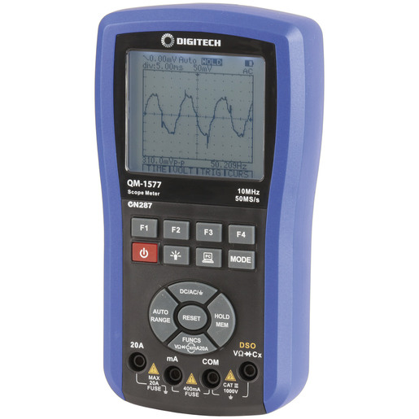

# qm1577

The QM-1577 DMM is a pretty cool multimeter/scope with a serial interface (with a SiliconLabs serial to USB converter) that lets you upload measurements and waveforms. It is now discontinued.

This was a "weekend project" from years ago that I never really finished.  I've put it on GitHub in the hope it might be useful to others.

The MATLAB code did work once to read from the device.
The first version was writte in MATLAB and worked somewhat, and the Python version is very incomplete.  I can't find the source I originally used to get
started.

There is no driver on [sigrok](https://sigrok.org) for this instrument.

References related to other models from the same manufacturer.  Not sure if they have the same chipsets or not:

* https://qm1571-multimeter.sourceforge.io
* https://www.nicholasdejong.com/digital-multimeter-release/
